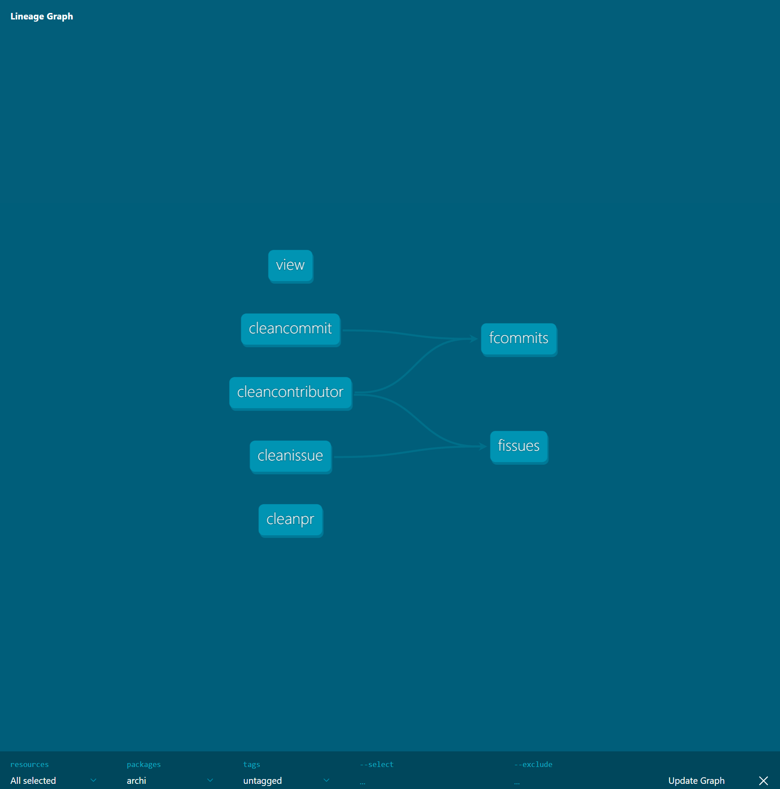
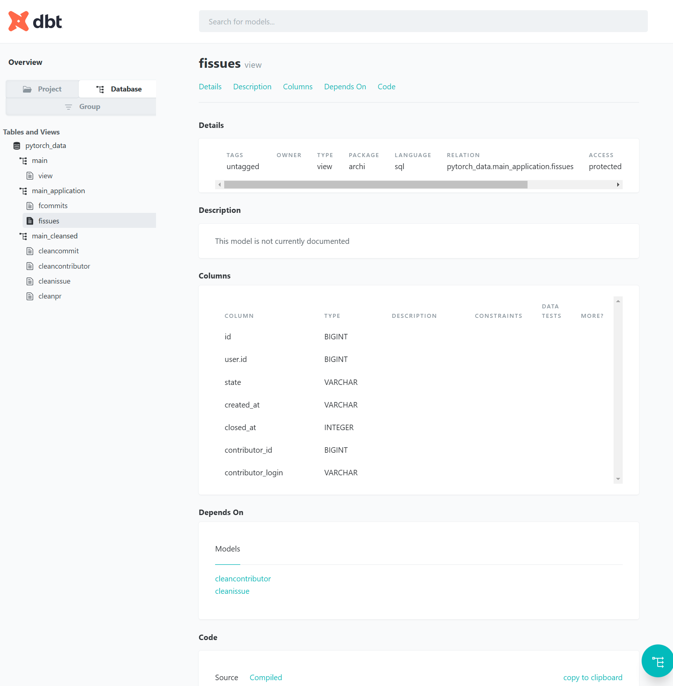

# ArchiDecisionnelle
Cours de M1

J'utilise l'API de GIT ainsi que des scripts python pour recuperer les données qui me serviront dans DuckDB

La source de données identifiée sera le repot git suivant :
https://github.com/pytorch/pytorch

GRAPH : 

DATABASE : 

Project : 

